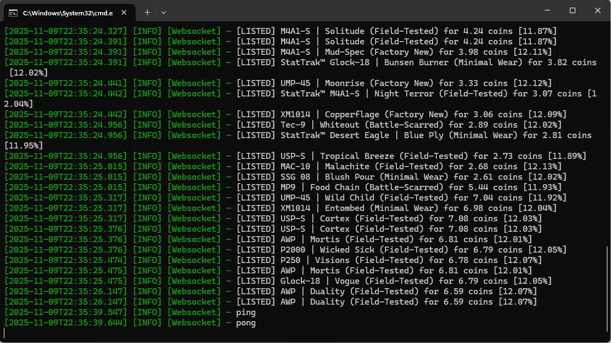
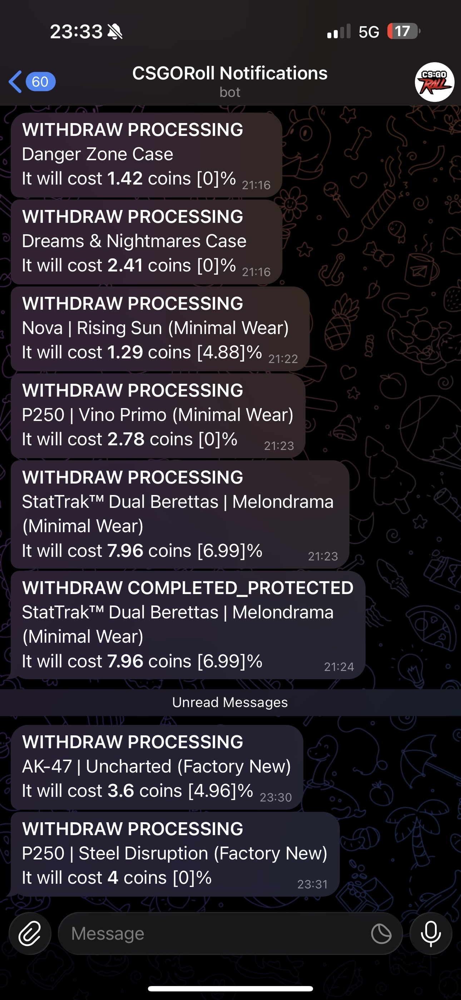
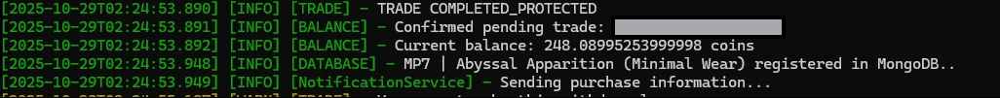

# CSGORoll Trading System

An automated system for buying and selling Counter-Strike 2 virtual items on the CSGORoll platform.

The system consists of multiple components that work together to ensure fast reaction to new listings, reliable authentication, and stable integration with both Steam and CSGORoll.

> **Note:** This repository contains an overview and demonstration of the system.  
> The full source code is available upon request.

## Features

- Real-time monitoring of new item listings
- Automated buying and selling
- Fast reaction to market changes
- Price comparison using external pricing API
- Steam trade offer handling
- Configurable pricing rules
- Proxy support

## Demo

Real-time listings received by the system:

[▶️ Watch Withdraw Bot Demo](https://raw.githubusercontent.com/Marerro/csgoroll-bot-showcase/main/screenshots/withdraw-bot-demo.mp4)

## Tech Stack

- Node.js + Go
- Real-time WebSocket communication
- TLS / browser fingerprinting techniques
- Browser automation
- Steam integration
- MongoDB
- Proxy support

## Architecture

See [architecture.md](./docs/architecture.md) for a overview of system design.
